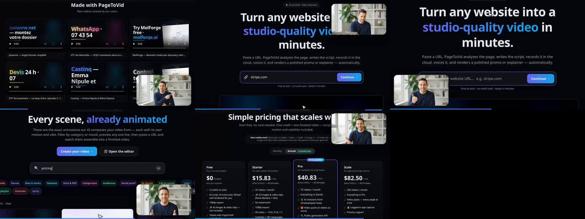

<div align="center">

# PageToVid

**Turn any website into a narrated, captioned video — from the web app, the API, or your AI assistant.**

[Website](https://pagetovid.com) · [Documentation](https://pagetovid.github.io/docs/) · [MCP server](https://pagetovid.github.io/docs/mcp/) · [API](https://pagetovid.github.io/docs/api)

</div>


PageToVid reads a page, writes the script, films the site in a real browser, records the voice-over
and renders an MP4 with captions — or builds a film from a storyboard you write. Connect it to
**Claude, Cursor, VS Code, Codex or Gemini CLI** over MCP and ask for a video in plain words.

```bash
claude mcp add --transport http pagetovid https://pagetovid.com/mcp
```



### Where things are

| | |
|---|---|
| 📘 [**docs**](https://github.com/PageToVid/docs) | The public documentation: guides, the full MCP tool reference, best practices, recipes. |
| 🔒 **pagetovid** | The product's source code (private). |

### Getting help

Questions and bug reports: [open an issue in docs](https://github.com/PageToVid/docs/issues/new/choose) ·
Security: see our [security policy](https://github.com/PageToVid/.github/blob/main/SECURITY.md).
